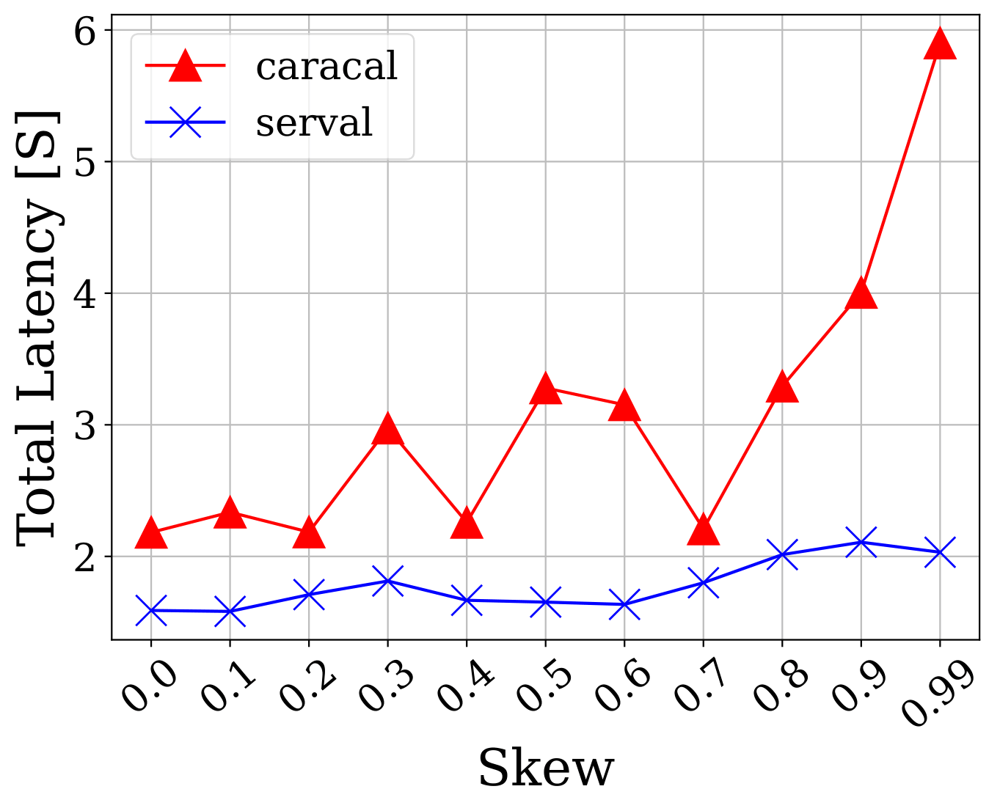
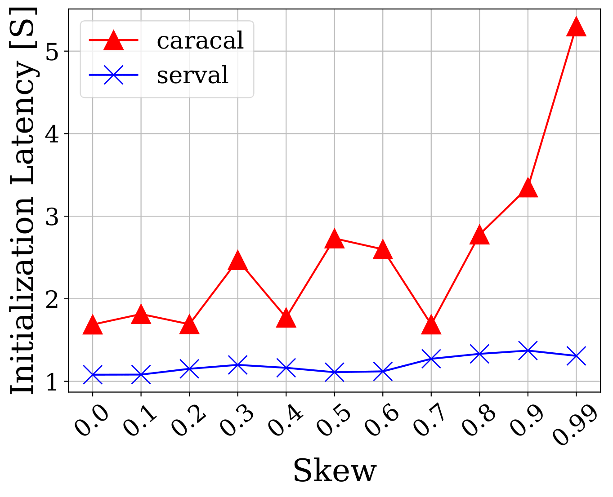
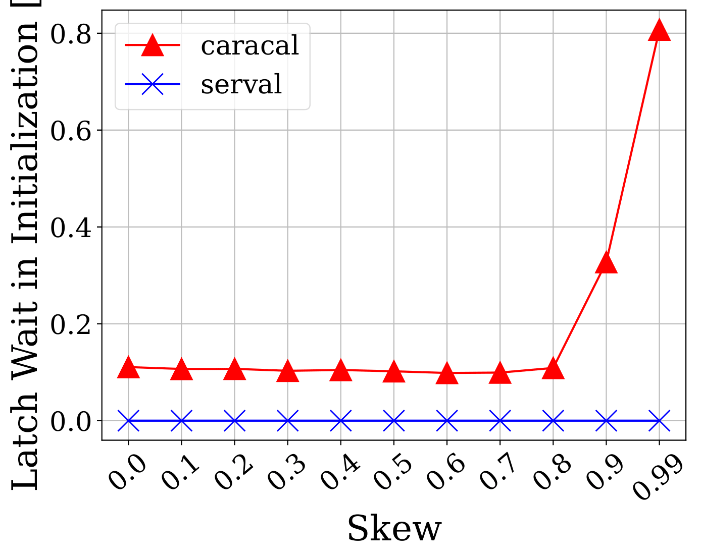
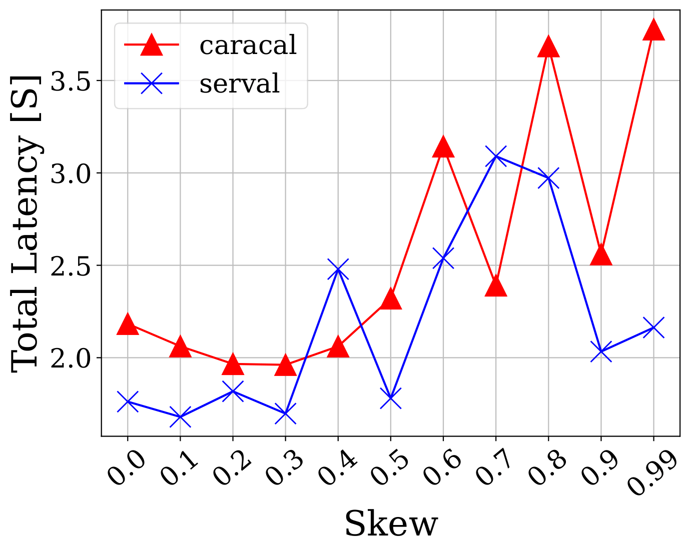
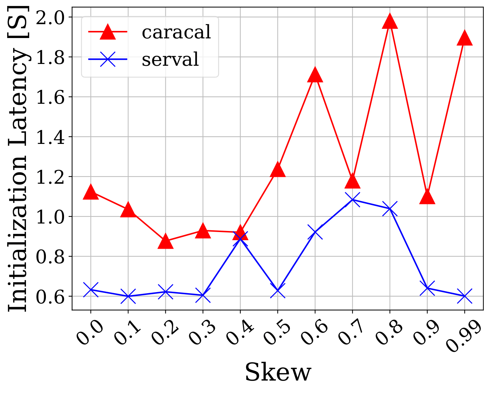
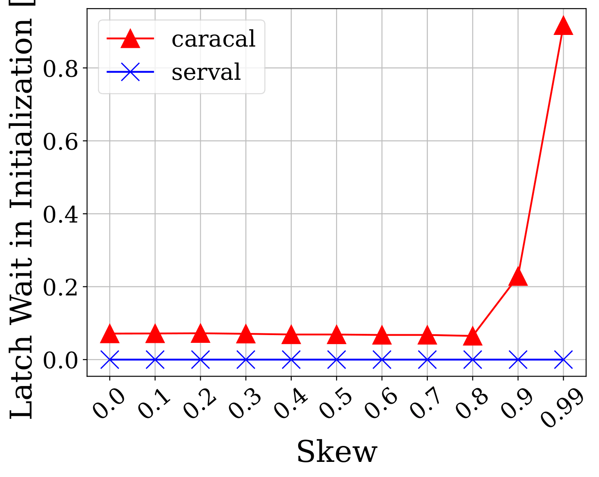

# serval
​
An implementation of deterministic concurrency concurrency control protocols by Haowen Li and Rina Onishi.
​
# Key features
- Extended from [tpcc-runner](https://github.com/rotaki/tpcc-runner) written by Riki Otaki
- Support YCSB benchmarks
- TPC-C benchmark is currently not supported
​
# Details
​
In this repository, 2 Deterministic Concurrency Control (DCC) protocols with two benchmarks are supported.
​
## Protocols
- Caracal
  - A multi-core, epoch-based, batch-based, shared-memory, multi-version deterministic concurrency control protocol proposed in the paper: ["Caracal: Contention Management with Deterministic Concurrency Control"](https://www.eecg.toronto.edu/~ashvin/publications/caracal.pdf).
- Serval
  - An optimized deterministic concurrency control protocol based on Caracal proposed by the authors of current repository.


## Optimizations in Serval
- Use Per-core Version Array instead of Per-core Per-row buffer in Caracal

- Incorporated 2 bitmaps for contended version
  - Core bitmap
  - Transaction bitmap

- Optimized Read Operations by using bitmaps

- BCBU (Batch Core Bitmap Update)" *Experiment in progress*

- Read Counter: *Implementation in progress*

## Benchmark
- TPC-C (Currently unsupported)
  -  [TPC-C](http://www.tpc.org/tpcc/) is a benchmark for online transaction processing systems used as "realistic workloads" in academia.
TPC-C executes a mix of five different concurrent transactions of different types and complexity to measure the various performances of transaction engines.
- YCSB
  - [YCSB](https://ycsb.site) is a micro-benchmark for database systems. YCSB provides six sets of core workloads (A to F) that define a basic benchmark for cloud systems. serval supports four of them (A, B, C, F).
​

Read more about each implementation in the docs directory.
​
# Getting Started
## Dependencies
- Ubuntu 20.04
- g++ >= 9
​
## Build and Execute (Experiments)
### TPC-C
Currently Unsupported
​
### YCSB
Perform experiments of Caracal and Serval with YCSB workloads
​
Execute the following command in the base directory to generate varying contention experiments:
```sh
python3 scripts/ycsb.py {workload_type} {num_records} {num_threads} {seconds} {skews} {reps_per_txn} 
```
**​The current default values:**
- workload_type: "X"
- num_records: 1000000
- num_threads: 64
- seconds: 1
- skews: [0.0, 0.1, 0.2, 0.3, 0.4, 0.5, 0.6, 0.7, 0.8, 0.9, 0.99]
- reps_per_txn: 10

**Plots that will be generated:**
- The comparison of Total Latency
- The comparison of Initialization Latency
- The comparison of Latch wait in Initialization Phase

Notes
- Note that in YCSB, an extra `-PAYLOAD_SIZE=X` argument to determine the payload size at compile time is needed.
- After building, the executable will be stored into the `build/bin` directory.
- In our experiments, we use Payload size of 4 bytes as default. 
- The number of experiments in each trial is set to 10.

​
```sh
python3 scripts/ycsb.py A 10000000 64 1 0.5,0.99 10 
```
​
The above example will create table with 10M records (each with four bytes) and executes YCSB-A with varying skews of 0.5 and 0.99, 10 operations per transaction using 64 threads for 1 second. See [ycsb documentation](https://github.com/brianfrankcooper/YCSB/wiki/Core-Workloads) for the details of the workload.
​
# Performance
## Overview
The following experiment results are ran using following commands:
```sh
python3 scripts/ycsb.py 
python3 scripts/ycsb.py A
```

## Write-only Workloads





## YCSB-A





# Author
- Haowen Li (Keio University, B4) 
- Rina Onishi (Keio University, M1)